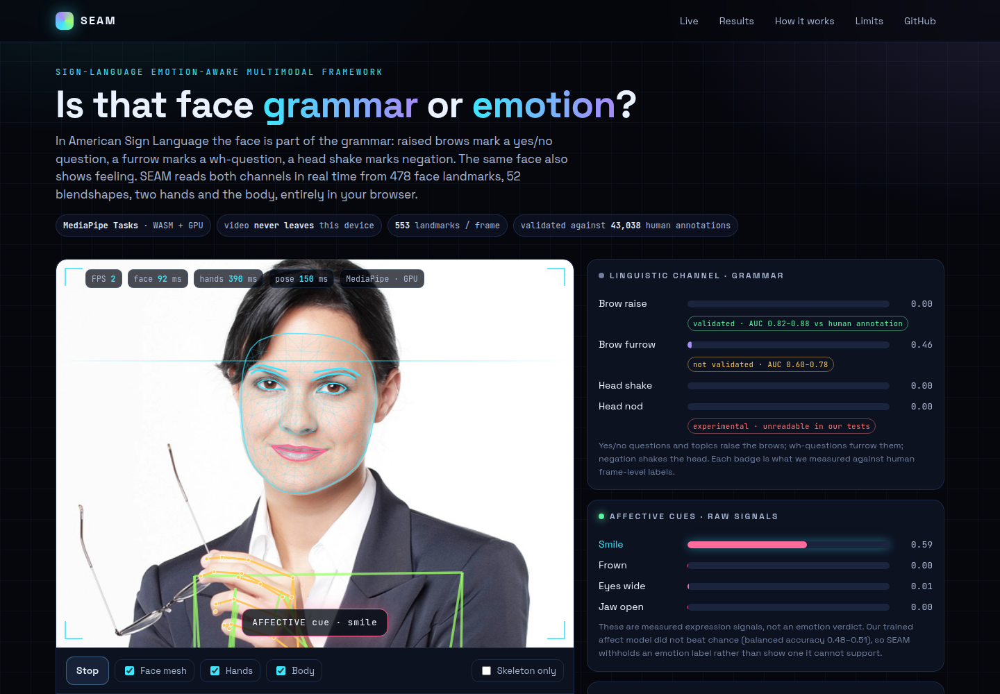
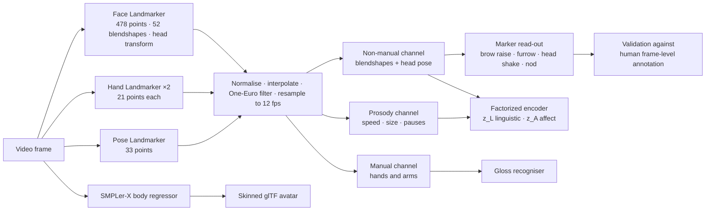
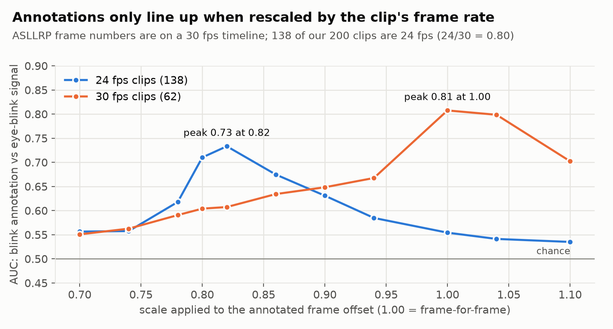
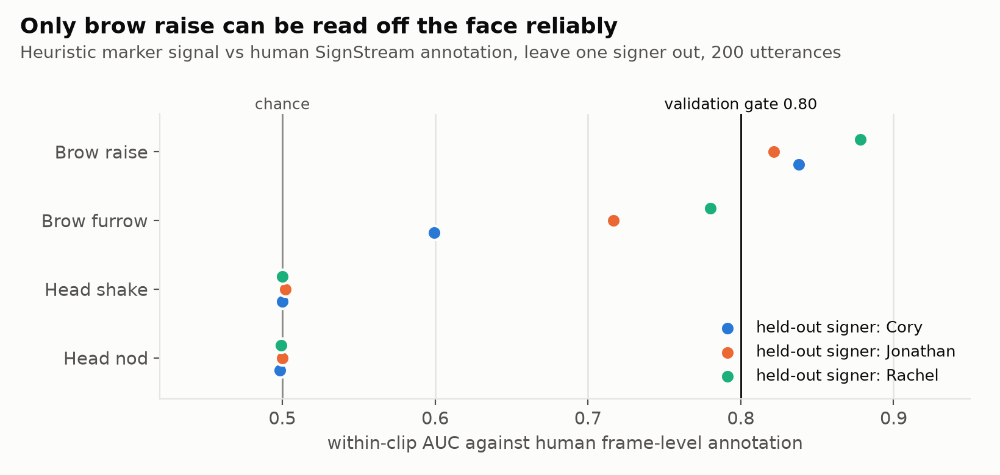
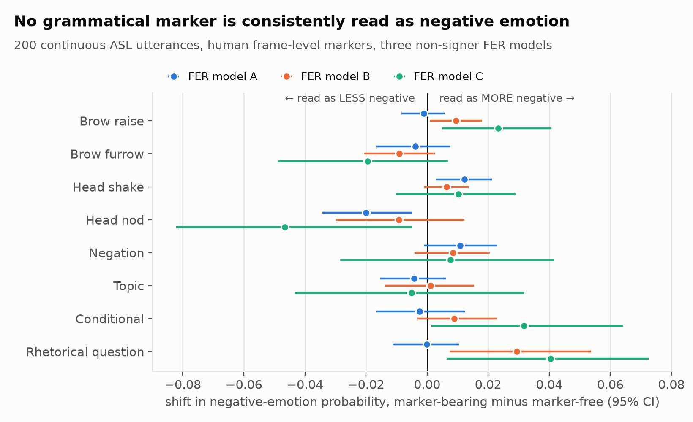
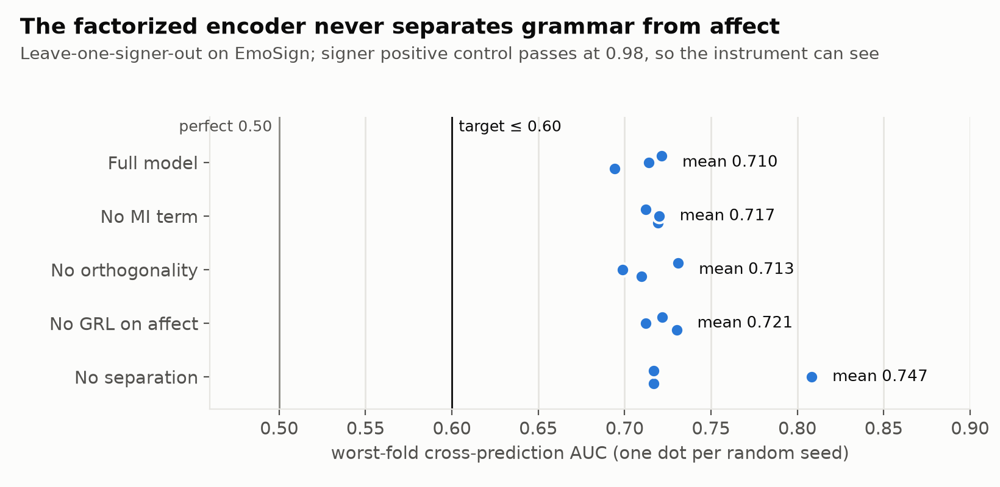
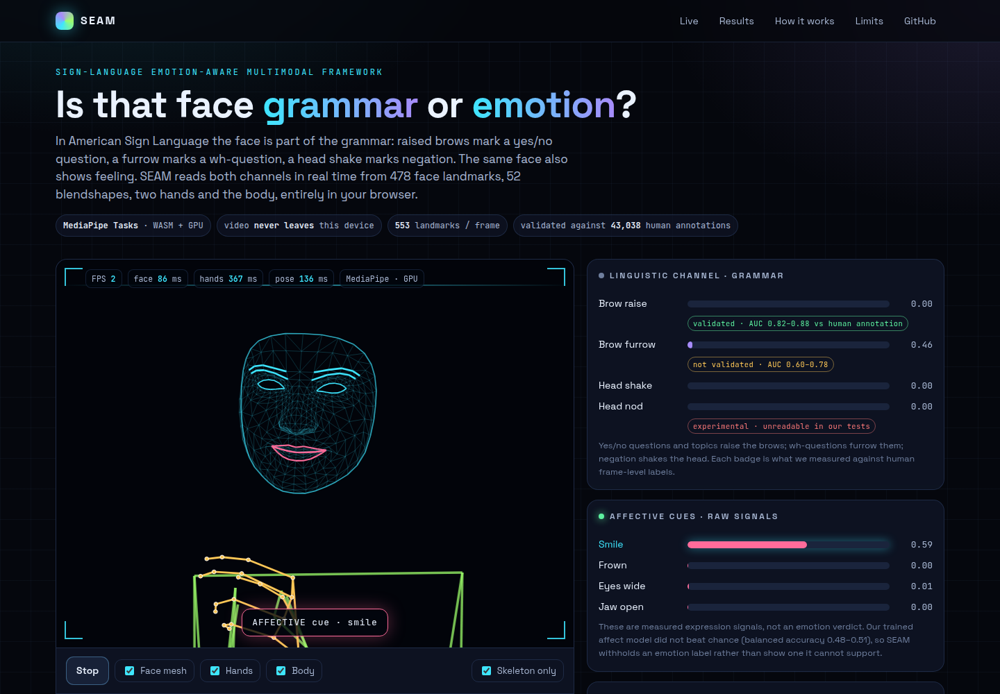

# SEAM — Sign-language Emotion-Aware Multimodal framework

**A real-time computer-vision pipeline that reads the face, head, hands and body of a person
signing, and tests whether facial *grammar* can be told apart from facial *emotion*.**

In American Sign Language the face is part of the grammar: raised brows mark a yes/no
question, furrowed brows mark a wh-question, and a head shake marks negation. The same face
also shows feeling. Emotion-recognition models are trained on hearing non-signers, so the
concern is that they read grammar as emotion. SEAM builds the vision pipeline needed to study
that, measures every part of it against human annotation, and reports what held and what did
not.

| | |
|---|---|
| **Live demo** | [`docs/index.html`](docs/index.html) — runs fully in the browser. Hosted on GitHub Pages once enabled: `https://bhuwanjoshi-01.github.io/SEAM-Sign-language-Emotion-Aware-Multimodal-framework/` |
| **Run locally** | `make setup && make serve`, then open <http://127.0.0.1:8000/live> |
| **Team reading guide** | [`docs/TEAM_GUIDE.md`](docs/TEAM_GUIDE.md) — what the project is, what happened, viva preparation |
| **Full experiment record** | [`paper/EXPERIMENT_LOG.md`](paper/EXPERIMENT_LOG.md), [`paper/CLAIMS_LEDGER.md`](paper/CLAIMS_LEDGER.md) |



*The live page: 478 face landmarks, two hands and the body tracked in the browser with
MediaPipe Tasks, and the two non-manual channels read out in real time. The image is
MediaPipe's public sample photo; no dataset video is shown or shipped.*

---

## Contents

1. [Results at a glance](#1-results-at-a-glance)
2. [Background](#2-background)
3. [Methodology](#3-methodology)
4. [Results](#4-results)
5. [The live demo](#5-the-live-demo)
6. [Limitations and ethics](#6-limitations-and-ethics)
7. [Future work](#7-future-work)
8. [Reproducing everything](#8-reproducing-everything)
9. [Repository map](#9-repository-map)

---

## 1. Results at a glance

| What we asked | What we measured | Verdict |
|---|---|---|
| Can the full perception stack run in real time on a 4 GB laptop GPU? | 41.8 ms median, **73.2 ms p95**, 19.7–20.4 FPS; **186 MB** peak VRAM with six models live against a 2,500 MB budget | **Yes** |
| Can a grammatical marker be read off the face on signers never seen? | Brow raise vs human frame-level annotation: within-clip AUC **0.838 / 0.822 / 0.878** on three held-out signers | **Yes, for brow raise** |
| Can the other markers be read too? | Brow furrow 0.60–0.78; head shake and head nod at **0.50** (chance), even with a fitted detector | **No** |
| Do emotion models read grammar as negative emotion? | Tested twice: 2,565 isolated signs, and 200 continuous utterances with human markers under a pre-registered rule. **No marker met the rule** | **Not supported** |
| Can a factorized encoder separate grammar from affect? | Worst-fold cross-prediction AUC **0.694–0.726** against a target of ≤ 0.60, in all 3 seeds and 5 ablation variants | **Refuted** |
| Can pose alone recognise glosses on this corpus? | WER 0.920, equal to always predicting the most frequent gloss | **Not at this data scale** |
| Can a video become an animated 3D avatar? | SMPL-X body regressed per frame and exported as a skinned, animated glTF (55 joints, 6.4 mm error) | **Yes** |

Two of our original hypotheses were refuted. We report them as results, because each was
measured with an instrument that passes a positive control. The record also contains the
bugs we found in our own instruments, which changed several numbers; they are listed in
[section 4.7](#47-what-we-got-wrong-and-how-we-found-out).

---

## 2. Background

### 2.1 The problem

Sign languages are full natural languages with five parameters: handshape, location,
movement, orientation, and **non-manual signals** (face, brows, mouth, gaze, head, torso).
Most sign-language recognition systems model the hands and discard the face. That loses two
things at once, because the face does two jobs:

| Function | Example in ASL | What a naive model sees |
|---|---|---|
| **Linguistic** (grammar) | Raised brows on a yes/no question; furrowed brows on a wh-question; head shake for negation | "Surprise", "anger", "disagreement" |
| **Affective** (emotion) | A smile, a frown, widened eyes | The same blendshapes as above |

The EmoSign benchmark (2025) reported that a hearing non-signer perceived neutral ASL clips
as negative, and that large multimodal models do poorly at emotion from sign video (GPT-4o
reaches a weighted F1 of 20.76). That is the motivation: a system for signers needs to know
which facial movements are grammar.

### 2.2 What we set out to test

| ID | Hypothesis |
|---|---|
| C1 | Non-signer facial-emotion models systematically read grammatical markers as negative emotion |
| C1b | The grammatical and affective signals can be separated in a learned representation, and the separation can be measured |
| C4 | The whole perception pipeline fits a 4 GB consumer GPU at interactive latency |

### 2.3 Data

| Dataset | What it is | How we used it |
|---|---|---|
| **EmoSign** | 200 ASL utterances, 4 signers, emotion labels from 3 Deaf annotators | The affect benchmark; leave-one-signer-out evaluation |
| **ASLLRP SignStream** | Linguistic annotation of the same utterances by ASL linguists: 2,407 utterances, **43,038 frame-aligned non-manual events** | Human ground truth for brow raise, furrow, head shake, nod, negation, questions |
| **WLASL** | 3,771 usable isolated-sign clips | First confound audit (isolated signs) |
| **RAF-DB** | Face images of non-signers with 7 emotion labels | Training (5,164 images) and testing (2,652) the non-signer emotion models we audit |
| **How2Sign landmarks** | 35,176 sentences with English | Prepared for translation; not yet trained |

EmoSign is built on ASLLRP, so the *same 200 utterances* carry emotion labels from Deaf
annotators and grammar labels from linguists. That overlap is what makes the grammar-versus-
emotion question testable at all. All 200 utterance IDs join exactly between the two.

Signer video is never redistributed. This repository contains code, tests, documentation and
figures only.

---

## 3. Methodology

### 3.1 System overview



Everything downstream of perception works on landmarks, not pixels. That is why the pipeline
is light (keypoints are a few hundred numbers per frame) and why the live demo can keep the
video on the user's device.

### 3.2 Perception: three MediaPipe graphs per frame

We use the **MediaPipe Tasks** API, not the older Holistic solution, because only Tasks'
Face Landmarker emits the 52 ARKit-style **blendshape coefficients** and the facial
transformation matrix.

| Graph | Output | Why we need it |
|---|---|---|
| Face Landmarker | 478 3D points, 52 blendshape scores, a 4×4 head transform | Brows, eyes, mouth and head pose: the non-manual channel |
| Hand Landmarker (×2) | 21 3D points per hand | The manual channel and signing prosody |
| Pose Landmarker | 33 body points | Shoulders for normalisation; arms |

Together that is **553 landmarks plus 52 blendshapes per frame**. Three implementation
details mattered:

- **The three graphs run concurrently.** TensorFlow Lite releases the Python GIL, so running
  them in threads cuts the median frame time from 73.0 ms to 41.8 ms, a **1.75× speed-up**.
  A test asserts the concurrent and sequential outputs are identical.
- **Timestamps must increase per graph instance.** Decoding two videos back to back without a
  process-wide monotonic clock silently degrades tracking.
- **The blendshape order is asserted, not assumed.** The real model emits `_neutral` plus 51
  coefficients in an order that differs from the ARKit documentation. A permuted basis would
  invert every brow rule while passing every shape check.

Where time goes (measured per module): hands 41.2 ms, pose 29.5 ms, face 15.9 ms. Input
resolution made no difference between 160 and 480 pixels, so the cost is per-graph overhead,
which is why concurrency helps and downscaling does not.

### 3.3 Preprocessing

1. **Gap interpolation** for frames where a hand or the face is not detected, with a maximum
   gap so a long absence is not invented.
2. **Normalisation**: translate to the shoulder midpoint and divide by shoulder width, making
   features invariant to where the signer stands and how far away they are.
3. **One-Euro filter**: an adaptive low-pass filter that removes jitter at low speed without
   adding lag at high speed, which matters for fast signing.
4. **Resampling to 12 fps** and windowing. Attention cost grows with the square of sequence
   length, so halving the frame rate cuts it by about 75%.

Each step has property tests: translation and scale invariance, filter causality, and so on.

### 3.4 Three feature channels

| Channel | Built from | Captures |
|---|---|---|
| **Manual (M)** | Hand and arm keypoints | What is being signed |
| **Non-manual (NM)** | 52 blendshapes, head rotation | Grammar and emotion on the face |
| **Prosody (P)** | Speed, movement size, pauses, jerk, repetition of the hands | *How* it is signed; Deaf annotators name these as emotion cues |

### 3.5 Reading grammatical markers from blendshapes

Each marker is a small, inspectable function of the face signals:

| Marker | Signal | ASL function |
|---|---|---|
| Brow raise | mean of `browInnerUp`, `browOuterUpLeft`, `browOuterUpRight` | Yes/no question, topic |
| Brow furrow | mean of `browDownLeft`, `browDownRight` | Wh-question |
| Head shake | oscillation of head yaw | Negation |
| Head nod | oscillation of head pitch | Affirmation |

Thresholds are **relative to the clip's own baseline**, not absolute, because a signer who
habitually holds a slight furrow would otherwise be "furrowing" on every frame. Head angles
come from a ZYX decomposition of the rotation block of MediaPipe's facial transformation
matrix.

### 3.6 Aligning human annotation to video frames

The linguists' annotations give start and end frames for every event. We found that those
frame numbers are on a **30 fps session timeline**, while 138 of our 200 clips are 24 fps
re-encodes. A frame-for-frame mapping therefore ran 25% fast on most of the data.

We did not discover this by reading documentation. We tested alignment against an
independent signal: annotated **blinks** against the eye-blink blendshape. A blink lasts a
few frames, so the two only agree when the mapping is right.



On the 24 fps clips the frame-for-frame mapping scores AUC 0.554 (near chance) and the
frame-rate-aware mapping 0.710. Each group peaks exactly where its frame rate predicts.
The conversion now lives in one function that requires the clip's frame rate and has no
default.

### 3.7 Validating markers against human annotation

For each marker we score the detector's per-frame signal against the human track:

- **Leave one signer out**: the three large signers (87, 54 and 52 clips) each take a turn
  as the unseen test signer.
- **Within-clip AUC**: the mean of per-clip AUCs, so a detector cannot score well merely by
  telling clips or signers apart.
- **A gate fixed before the run**: validated at 0.80 on every large fold.
- **Two detectors per marker**: the hand-written signal above, and a logistic regression on
  all 52 blendshapes plus head pose and its short-range dynamics.

### 3.8 The confound audit: do emotion models read grammar as negative emotion?

**The emotion models.** We trained three compact CNNs from scratch on RAF-DB (non-signer
faces) so that their training distribution is known. They reach 61.7%, 63.7% and 66.3% test
accuracy. Faces are cropped from the landmarks and passed through one shared front end:
grayscale, histogram equalisation, per-image standardisation.

**The design.** We compare the model's *negative probability mass* (anger + disgust + fear +
sadness) on windows that carry a marker against matched windows of the same clip that do
not:

| Element | Choice | Reason |
|---|---|---|
| Contrast | Within clip | A clip's emotion label is constant, so emotion cannot cause the difference |
| Matching | Nearest window on hand speed and movement size | So a busy window is not compared with a still one |
| Region | Only inside the signing span | So a signing face is not compared with a resting face |
| Uncertainty | Bootstrap over clips, 4,000 resamples | Windows in a clip are correlated |
| Power | Minimum detectable effect beside every null | A null without its power is not a finding |
| Placebo | The same marker track, shifted in time | A real effect must vanish here |
| Decision rule | Positive shift, Bonferroni-corrected, in 2 of 3 models | Fixed before the first run |

### 3.9 The factorized encoder

The model has two small branches over the non-manual and prosody features. One produces a
linguistic code `z_L`, the other an affective code `z_A`, and the loss pushes them apart:

```
L = CE(head_L(z_L), marker)                    linguistic supervision
  + BCE(head_A(z_A), emotions)                 affective supervision (multi-label)
  + BCE(head_A'(GRL(z_L)), emotions)           z_L must not predict emotion
  + CE(head_L'(GRL(z_A)), marker)              z_A must not predict the marker
  + λ · ‖ z_Lᵀ z_A ‖²                          orthogonality
  + λ · JSD-MI(z_L ; z_A)                      mutual-information bound
```

`GRL` is a gradient-reversal layer: the head learns to predict, and the encoder beneath it
learns to prevent that.

**How separation is measured.** After training, frozen probes try to predict emotion from
`z_L` and the marker from `z_A`. The **cross-prediction AUC** is 0.5 when the codes are
perfectly separated. The target, fixed in advance, was ≤ 0.60 on the worst fold under
leave-one-signer-out.

**The positive control.** A metric that reads 0.5 on everything proves nothing, so the same
probe must be able to detect something that is certainly there: which signer is signing. It
must score at least 0.80.

### 3.10 Gloss recognition baseline

A linear model on per-token pose summaries (mean, spread and frame-to-frame change of the
upper-body and hand landmarks), evaluated signer-disjoint, with three references reported
beside it: the most-frequent-gloss baseline, a shuffled-label control, and the
out-of-vocabulary floor.

### 3.11 Video to 3D avatar

A learned whole-body regressor (**SMPLer-X**, ViT-B) predicts SMPL-X body parameters per
frame: pose, hand articulation, facial expression and body shape. We convert its output to a
standard orientation, repair frames where the regressor loses the person, and export one
**skinned mesh with a real animation clip** in glTF format (55 joints, inverse bind matrices,
110 animation channels). The export is verified by loading it in a completely independent
reader, three.js in headless Chrome, which found two bugs our own verifier had agreed with.

### 3.12 Efficiency

Models are exported to ONNX and checked for numerical parity against PyTorch on real faces.
Latency is reported as percentiles over individually timed calls, on the target GPU, with
the CPU governor and core clock recorded, because the same benchmark read 118 ms instead of
42 ms when the machine was in power-save mode.

### 3.13 Making the numbers trustworthy

This project found many of its own bugs, and built guards so they cannot return silently:

- **Provenance test**: every number in the experiment log must exist in a result file.
- **Staleness test**: every result file records a fingerprint of the code that produced it,
  and the build fails when the code changes underneath a cited result.
- **One front end**: training and inference paths must call the same preprocessing function,
  asserted by test.
- **Positive controls**: every metric is shown to detect an effect that is planted.

The suite has over 500 automated tests.

---

## 4. Results

### 4.1 Real-time perception on a 4 GB GPU

| Measure | Value |
|---|---|
| Median / p95 / p99 frame time | 41.8 / **73.2** / 78.1 ms over 900 timed calls |
| Sustained rate | 20.4 FPS (repeat runs: 19.7, 20.0, 20.3) |
| Sequential baseline | 73.0 ms, 12.8 FPS, so concurrency is worth 1.75× |
| Peak VRAM, perception | 90 MB |
| Peak VRAM, six models live | **186 MB** of a 2,500 MB budget (7%) |
| Emotion CNNs on ONNX Runtime | 6.9–11.6 ms median per call, 188–578 KB on disk |

The target of 20 FPS is met at the median and missed at the low end, and we report it that
way. The limit is the CPU, not VRAM.

### 4.2 Which markers can actually be read



| Marker | Cory | Jonathan | Rachel | Verdict |
|---|---|---|---|---|
| **Brow raise** | 0.838 | 0.822 | 0.878 | **Validated** |
| Brow furrow | 0.599 | 0.717 | 0.780 | Not validated |
| Head shake | 0.500 | 0.502 | 0.500 | Unreadable |
| Head nod | 0.498 | 0.500 | 0.499 | Unreadable |

**Brow raise works**, on signers the detector was never tuned on, using the plain mean of
three blendshapes. A fitted 61-feature detector did *worse* (0.70–0.87): with four signers,
more capacity bought less generalisation.

**Head movements cannot be read from this input.** Even a supervised detector on head
angles and their dynamics stays near chance. The annotators mark a head shake in 89 of the
200 clips, so the events are there; the head transform on 256-pixel crops does not carry
them.

### 4.3 Emotion models did not read grammar as negative emotion



On 200 continuous utterances with human frame-level markers (2,646 scored half-second
windows), **no marker met the pre-registered rule**:

- **Brow furrow leans the other way** in all three models. This is the marker the usual
  example rests on (a wh-question furrow read as anger).
- **Brow raise and rhetorical questions lean positive in two models** and do not survive
  correction for multiple tests.
- **Yes/no and wh-questions could not be tested**: only 8 and 4 clips contribute.

The same analysis *without* restricting to the signing span reports support for brow raise.
That version compares signing faces with resting faces, which is a different question. The
restriction was decided before either analysis ran.

On isolated signs (2,565 WLASL clips) the result was also null, with shifts between −0.008
and +0.002 against a baseline of 0.297.

**What this does not show:** that the confound does not exist. These are small CNNs, and
question marking could not be tested on this corpus.

### 4.4 The factorized encoder does not separate grammar from affect



| Quantity | Result | Target |
|---|---|---|
| Worst-fold cross-AUC, heuristic labels | 0.694 | ≤ 0.60 |
| Worst-fold cross-AUC, human labels | 0.726 | ≤ 0.60 |
| Over three seeds | 0.710 ± 0.014 | ≤ 0.60 |
| Signer positive control | 0.981 | ≥ 0.80 |
| Emotion balanced accuracy | 0.481–0.507 | reference 0.5 |

The gate fails in every seed and every ablation variant, while the positive control passes,
so the instrument can see and the model does not separate. Swapping the heuristic grammar
labels for human ones did not rescue it, which rules out label noise as the cause. The
emotion head does not beat chance, so the live demo does not show an emotion label.

A related finding that others can reuse: our heuristic grammar labels agreed with human
annotation well for negation (Cohen's κ = 0.639) and rhetorical questions (0.734), and at
**chance** for wh/yes-no questions (0.028) and conditionals (0.038).

### 4.5 Gloss recognition

On 1,736 tokens over 546 glosses (3.18 examples per gloss), word error rate is 0.920,
identical to always predicting the most frequent gloss. This is a data-scale result, not
evidence that pose is uninformative.

### 4.6 Avatar

| | |
|---|---|
| Structure | 1 skinned mesh, 55 joints, 110 animation channels |
| Error against the mesh pipeline | 6.4 mm (glTF allows 4 skinning influences; SMPL-X uses up to 10) |
| Detection coverage on 4 clips, 541 frames | 0.99–1.00 |
| Verified by | three.js `GLTFLoader` in headless Chrome |

No human preference study has been run, so we make no claim about how good the avatar looks.

### 4.7 What we got wrong, and how we found out

| Bug | Effect | How it was caught |
|---|---|---|
| Emotion models trained and applied with different face crops | All three predicted one class for all 200 clips | Per-frame spread within a clip was 0.0002 |
| Head yaw read from the wrong matrix entries | Head shake was zero for a real head shake; one "positive result" was produced by the bug | The live demo showed a blank row |
| Annotation frames read at 30 fps on 24 fps clips | Labels pointed at the wrong frames on 138 of 200 clips | The blink alignment test in section 3.6 |
| Gloss classifier could only predict one gloss | Its "negative result" was the baseline by construction | A planted-signal positive control |
| Baseline model trained without the main model's class weights | A five-fold "improvement" that was an artefact | Reading the re-run instead of comparing headlines |
| Reproduction script skipped six of its own commands | The provenance check had never run from the pipeline | Reading what was executed, not the stage headers |

Each is now covered by a test.

---

## 5. The live demo

[`docs/index.html`](docs/index.html) is one static file. It loads MediaPipe Tasks (WASM, GPU
when available) and runs all three landmarkers on your webcam or on a video file you choose.
**No video or landmark leaves the device.**

| Panel | Shows |
|---|---|
| Stage | Face mesh, hand skeletons and upper body drawn over the video, with FPS and per-model latency |
| Linguistic channel | Brow raise, brow furrow, head shake, head nod, each with the validation result we measured |
| Affective cues | Smile, frown, eye widening, jaw opening as raw signals, with no emotion label |
| Head pose and prosody | Yaw, pitch, roll; hand speed and signing-space size in shoulder widths |
| Timeline | The last twelve seconds of four signals |
| Marker events | An entry each time a marker stays active, with its ASL meaning |

"Skeleton only" hides the camera image and leaves just the landmarks:



The page is checked in a real browser by `scripts/site_smoke.py`, which runs headless Chrome
with a video file standing in for the camera and reads back what the page measured.

```bash
make serve                                   # http://127.0.0.1:8000/live
python scripts/site_smoke.py --video my_clip.mp4 --shot out.png
```

The server also offers `/` (server-side marker analysis), `/avatar` (the 3D avatar viewer,
after `make demo-avatar`) and `/api/coverage` (what is and is not claimed).

---

## 6. Limitations and ethics

- **Four signers, 200 utterances.** Every result is leave-one-signer-out, and none should be
  read as general across signers, dialects or recording conditions.
- **Lab-recorded, scripted signing.** Nothing here is evaluated on conversation.
- **Emotion labels are annotators' perceptions**, not the signer's internal state, and
  agreement on some classes is low.
- **We are hearing researchers.** The grammar labels come from ASL linguists and the emotion
  labels from Deaf annotators; no Deaf signer has evaluated this system.
- **No clinical, legal or emergency use.**
- **Data stewardship.** ASLLRP and EmoSign video are used under research terms and never
  redistributed. The SMPL-X body model is licence-gated and not included.
- **Privacy.** The demo processes video on the device. The local server binds to localhost.

---

## 7. Future work

These parts of the original plan are **not done** and are marked as future work.

| Item | State | What it needs |
|---|---|---|
| Sign-to-English translation (pose → T5-small on How2Sign) | Data prepared: 35,176 sentences. No model code | About 2–3 days of GPU time. Published results near 10 BLEU rely on pretraining on about 1,000 hours of extra video; from How2Sign alone, low single digits are expected |
| Emotion recognition compared with published baselines | Never run on a comparable protocol | A decision on which published protocol to match |
| Emotion-conditioned text generation | Not started | A working emotion signal, which we do not have |
| Emotion-modulated avatar | Avatar works; modulation not built | Same dependency |
| Avatar preference study | Stimuli and blinding ready; zero raters | Five or more raters, ideally including a Deaf signer |
| Question marking in the confound audit | Too few clips in this corpus | Running perception over 1,354 further utterance videos already on disk |
| A working head-movement instrument | Unreadable from the face transform | Head pose from higher-resolution crops, or a dedicated estimator |
| Cross-lingual test on Indian/Nepali sign data | Blocked | Establishing the terms of use of the local data |

---

## 8. Reproducing everything

```bash
make setup                 # editable install + pre-commit hooks
make lint typecheck test   # ruff, mypy, the whole test suite
make serve                 # live demo at http://127.0.0.1:8000/live
make serve-check           # boots the server and asserts every page
make repro                 # regenerates every cited result, in dependency order
make provenance            # fails on an untraced number or a stale result
python scripts/make_report_figures.py   # redraws the figures in this README
```

Environment: Python 3.12, PyTorch 2.13, MediaPipe 0.10.14, an RTX 3050 (4 GB). The datasets
are not included; `make readiness` reports what is present and what each missing item blocks.
The SignStream annotations require a free account with the ASLLRP data portal.

---

## 9. Repository map

| Path | What is there |
|---|---|
| `src/seam/perception/` | MediaPipe wrappers, landmark extraction, SMPLer-X adapter |
| `src/seam/preprocess/`, `src/seam/features/` | Normalisation, filtering, markers, prosody, pose features |
| `src/seam/data/` | Dataset loaders, the SignStream parser, frame alignment |
| `src/seam/eval/` | Emotion models, the confound audit, probes, leave-one-signer-out |
| `src/seam/affect/` | The factorized encoder and its loss terms |
| `src/seam/avatar/` | Skinning, glTF export, rendering |
| `src/seam/serve/`, `src/seam/web/` | The local server and its pages |
| `docs/` | The standalone live demo, figures, and the team guide |
| `scripts/` | One script per experiment, plus the reproduction and smoke tests |
| `tests/` | Unit, property, integration and provenance tests |
| `paper/` | Experiment log, claims ledger, paper scaffold |
| `plan.md` | Milestones, gates and the KPI dashboard |

### Acknowledgements

EmoSign (Chua et al., 2025); the American Sign Language Linguistic Research Project (Neidle
and Metaxas, Boston and Rutgers Universities, <http://www.bu.edu/asllrp/>,
<http://dai.cs.rutgers.edu/>); WLASL; RAF-DB; How2Sign; MediaPipe; SMPL-X and SMPLer-X.
